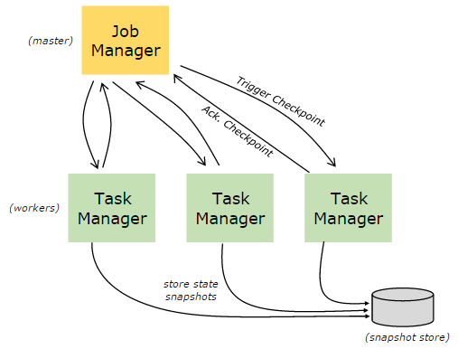
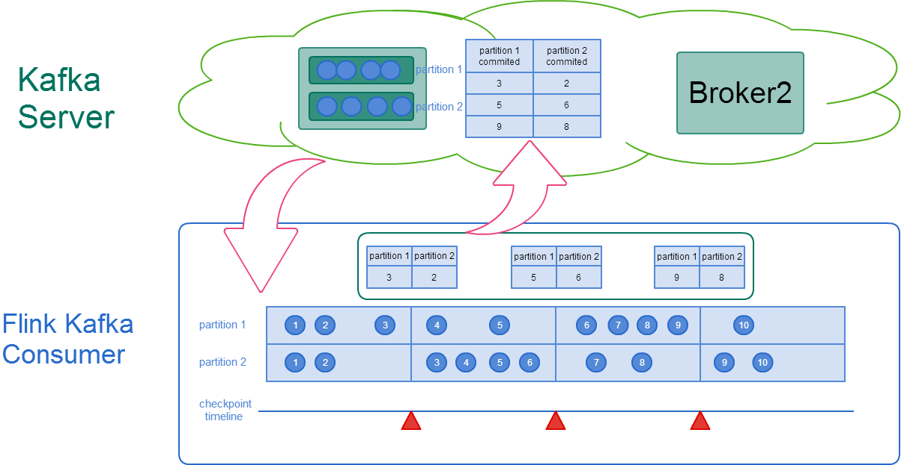
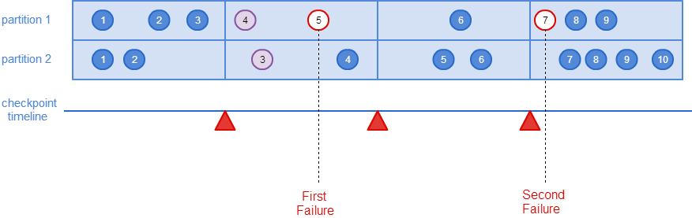
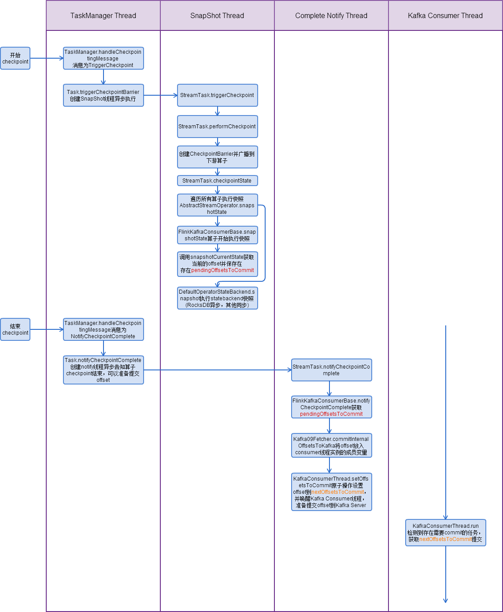

## Flink Kafka consumer checkpoint机制

> 诸国栋 2017.2.7
>
> 基于Apache Flink 1.3-SNAPSHOT

[TOC]

### 1 概述

Flink中Kafka consumer算子是有状态的，Kafka offset就是该算子的状态。consumer算子深度集成了Flink checkpoint机制，保证了exactly-once（一条消息被处理一次，区别于at-least-once和at-most-once）。



checkpoint机制由Job Manager的```CheckpointCoordinator```模块控制，用户可以配置checkpoint周期（与savepoint不同，savepoint由用户在用户代码中手动触发）。当触发一次checkpoint，Job Manager会通知Task Manager，Task Manager收到通知后，异步执行所有StreamTask的快照，针对一个StreamTask，遍历所有operator，在operator上执行```snapshotState```并异步等待结果。当Job Manager的```CheckpointCoordinator```模块检测到checkpoint完成，会通知所有的Task Manager。

#### offset提交策略

开启checkpoint的情况下，不会自动向Kafka服务器提交offset确认请求，而是在Task Manager得到Job Manager下发的checkpoint完成通知后，通知所有算子任务，包括consumer算子，将完成checkpoint的offset提交回Kafka Server。

在09版本Fetcher类```Kafka09Fetcher```构造方法中，有如下代码，根据是否开启checkpoint决定是否设置自动提交offset。

```java
// if checkpointing is enabled, we are not automatically committing to Kafka.
kafkaProperties.setProperty(
	ConsumerConfig.ENABLE_AUTO_COMMIT_CONFIG,
	Boolean.toString(!enableCheckpointing));
```

> 注1：08老版本consumer算子的Fetcher中不存在此类代码，因08版本JM通知checkpoint完成后consumer算子将offset提交到zookeeper中保存，而09版本开始使用提交offset确认到Kafka服务器的策略实现checkpoint功能

> 注2：enable.auto.commit运行参数配置项在09之后的Flink kafka consumer应用中无效，无论是否配置了checkpoint




### 2 样例

开启checkpoint功能，需要在Flink的Kafka应用代码中加入如下代码：

```java
//配置checkpoint间隔
env.getCheckpointConfig().setCheckpointInterval(15000);
//配置statebackend
env.setStateBackend(new FsStateBackend("file:////tmp/backend"));
```

为了直观说明checkpoint功能，编写测试代码如下，使用抛异常方式模拟流应用异常，当进入的事件数超过7个时流应用抛异常重启：

```java
public class ReadFromKafka {
	static int count = 0;

	public static void main(String[] args) throws Exception {
		StreamExecutionEnvironment env = StreamExecutionEnvironment.getExecutionEnvironment();
		env.setParallelism(1);
    	env.getCheckpointConfig().setCheckpointInterval(15000);
    	env.setStateBackend(new FsStateBackend("file:////tmp/backend"));
		ParameterTool parameterTool = ParameterTool.fromArgs(args);
		DataStream<String> messageStream = env.addSource(new FlinkKafkaConsumer010<>(
		    parameterTool.getRequired("topic"), new SimpleStringSchema(),
          	parameterTool.getProperties()));

		messageStream.rebalance().map(new MapFunction<String, String>() {
			@Override
			public String map(String s) throws Exception {
				if (count++ == 7) {
					count = 0;
					throw new Exception("Failed.");
				}
				return s;
			}
		}).print();

		env.execute();
	}
}
```

如下图所示，Kafka消息按如下时间点依次进入Kafka Consumer：




当partition 1的offset 5的消息进入Flink，进入测试代码中的异常分支，流应用重启后，重新向Kafka订阅消息，会从最近保存的checkpoint点的offset开始消费，在此例中，最终print结果中，只有partition 1 offset 4和partition 2 offset 3这两条消息会打印两次（partition之间消息不保序，同partition内保序），第二次异常分支由partition 1 offset 7的消息触发，因其为最近checkpoint后的第一条消息，因此流应用重启后继续从此开始消费。


### 3 流程

以下分别说明正常的checkpoint流程和异常的恢复流程

#### 正常流程

下图为从Task Manager收到Job Manager的checkpoint消息后Flink Kafka Consumer算子一次完整checkpoint过程的线程时序图：



> 注：正常的checkpoint流程不涉及Consumer算子主线程。

#### 异常恢复流程

Consumer算子初始化时，在```FlinkKafkaConsumerBase.initializeState()```方法中，会调用```OperatorStateStore.getSerializableListState```尝试从statebackend中获取最近一次checkpoint保存的offset信息，并将其保存在```restoreToOffset```中，当Consumer算子主线程开始运行时（```FlinkKafkaConsumerBase.run()```)，先尝试从```restoreToOffset```中获取offset，并保存到Consumer算子主线程和Kafka Consumer线程共有的partition集合引用中，从而Kafka Consumer线程可以从该checkpoint指定的partition offset中开始消费消息。


