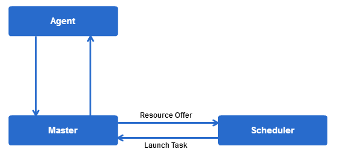
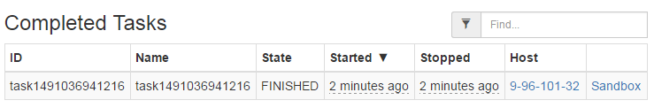
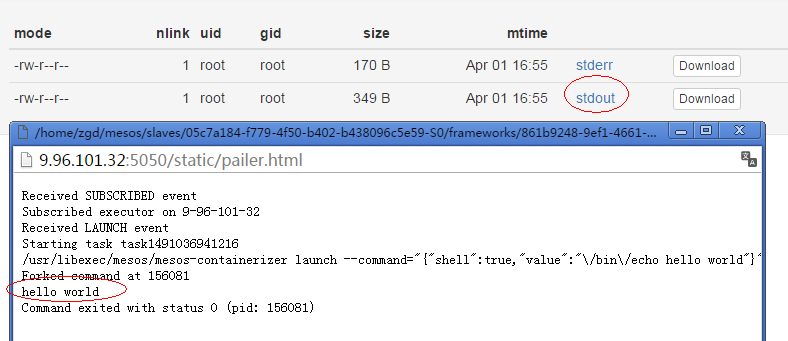

## Helloworld on Mesos


#### Mesos Framework

在Mesos上运行的用户应用以framwork的方式呈现，framework包含三个基本组成部分：

* Client

  Client向framework提交任务(task)，task是mesos中最小的执行单位，包含执行所需的资源(cpu和内存等)

* Scheduler

  需要实现mesos的Scheduler接口，负责具体的资源分配和任务调度相关工作

  

* Executor

  提供task运行环境，在后文的例子中，使用mesos提供的默认的Command Executor，即Linux命令行执行器

#### Hello World

Mesos内部使用Google protocol buffer实现消息序列化，因此在Client实现的消息处理和封装都遵循protocol buffer模式的接口（getXXX、setXXX），消息体定义参见`include/mesos/mesos.proto`，参见[完整代码](https://github.com/SeptimusZhu/mesos_helloworld)，列举主要步骤如下：

* 创建Framework

  定义Framework基本信息，包括名称、用户、是否checkpoint、超时时间等

  ```scala
  val framework = FrameworkInfo.newBuilder
        .setName("HelloWorld")
        .setUser("zgd")
        .setRole("*")
        .setCheckpoint(false)
        .setFailoverTimeout(0.0d)
        .build()
  ```


* 创建Scheduler实例

  实现Scheduler接口并实例化，主要实现`resourceOffers`方法，处理Master提供的资源并启动Task

  ```scala
  class MyScheduler extends Scheduler {
    //...
    override def resourceOffers(driver: SchedulerDriver, offers: java.util.List[Offer]) {
      //...
    }
    //...
  }
  ```

  ```scala
  val scheduler = new MyScheduler
  ```

* 提交Task

* 启动Mesos Scheduler Driver

  Scheduler Driver负责注册Framework和Scheduler到Mesos Master，建立Master和Scheduler之间的连接。

  ```scala
  val mesosURL = "9.96.101.32:5050"
  val driver = new MesosSchedulerDriver(scheduler, framework, mesosURL)
  driver.run()
  ```

* 编译并提交

  ```shell
  java -cp mesos_helloworld.jar com.huawei.mesos.HelloWorld "/bin/echo hello world"
  ```

* 查看输出

  登陆mesos网页，查看刚刚已完成的Task，查看Sandbox下的stdout

  

