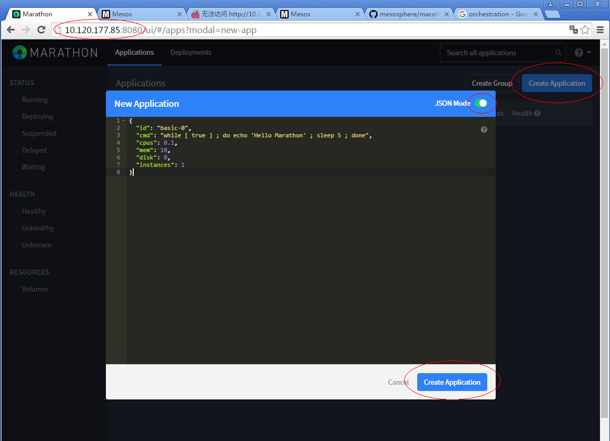

## Marathon安装与Flink部署

[TOC]

#### 1.简介

```
Marathon is a production-proven Apache Mesos framework for container orchestration. Marathon provides a REST API for starting, stopping, and scaling applications. 
```

翻译一下，Marathon是一个在工业界广泛使用的Mesos框架，用于容器编排。Marathon提供了一套REST API用于任务的启动、停止和扩容。

Marathon框架通常用于管理长时间运行的任务。

#### 2.下载安装

从官网下载Marathon的rpm安装包（[下载链接](http://repos.mesosphere.com/el-testing/6/x86_64/RPMS/marathon-1.4.0-1.0.560.el6.x86_64.rpm)）并安装（推荐的安装方式）

```shell
rpm -ivh marathon-1.4.0*.rpm
```

也可以从Marathon官网下载二进制的包（[下载地址](http://downloads.mesosphere.com/marathon/v1.4.1/marathon-1.4.1.tgz)），使用`$MARATHON_HOME/bin/start --master ip:port --zk zk://ip:port/marathon`启动Marathon。

#### 3.启动

命令样例如下，需要首先启动mesos集群和zk服务，不在此赘述。

```shell
/usr/bin/marathon run_jar --master 10.120.177.85:5050 --zk zk://10.120.177.85:2181/marathon
```

> 注：不同版本marathon在zk上的leader信息不兼容，需确保zk中/marathon目录未被不同版本的marathon服务使用过

可以使用`/usr/bin/marathon run_jar --help`查看其它配置项说明。

#### 4.提交任务

可以用两种方式提交应用，WebUI和curl。

打开Marathon WebUI（默认端口8080），点击Create Application，可以选在使用JSON模式描述任务信息，或者使用UI界面，本例中使用JSON方式，在cmd中写入运行的命令，点击右下角的Create Application提交。



#### 5.部署Flink

只需要将cmd的内容修改为`$FLINK_HOME/bin/mesos-appmaster.sh-Dmesos.master=node:5050 -Dmesos.initial-tasks=1`即可