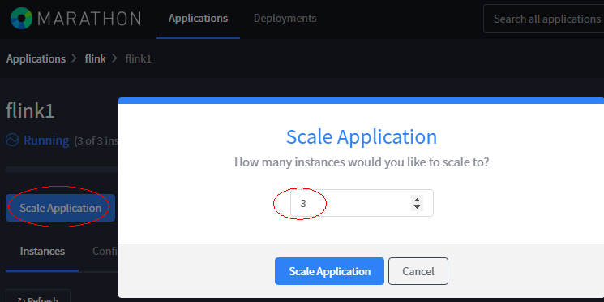
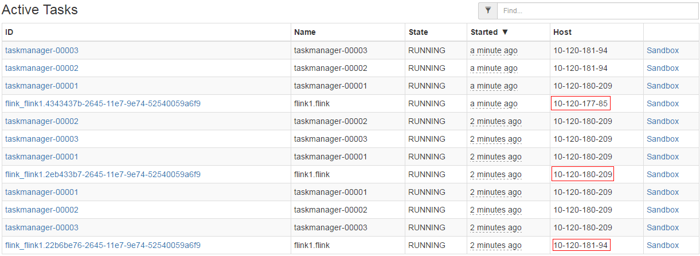
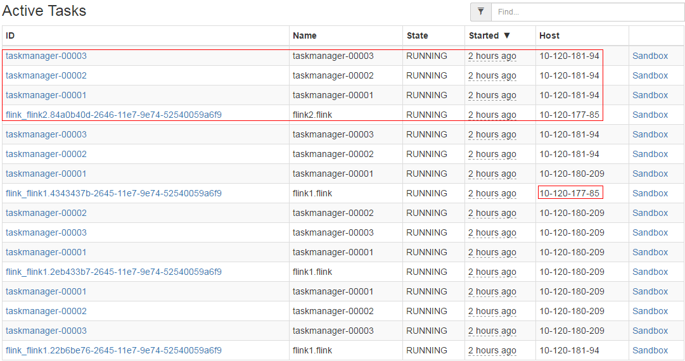
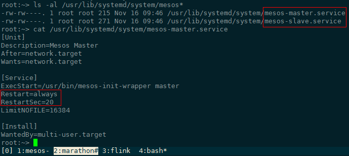

## Marathon安装与Flink部署

[TOC]

#### 1.简介

```
Marathon is a production-proven Apache Mesos framework for container orchestration. Marathon provides a REST API for starting, stopping, and scaling applications. 
```

翻译一下，Marathon是一个在工业界广泛使用的Mesos框架，用于容器编排。Marathon提供了一套REST API用于任务的启动、停止和扩容。

Marathon框架通常用于管理长时间运行的任务。

#### 2.下载安装

从官网下载Marathon的rpm安装包（[下载链接](http://repos.mesosphere.com/el-testing/6/x86_64/RPMS/marathon-1.4.0-1.0.560.el6.x86_64.rpm)）并安装（推荐的安装方式）

```shell
rpm -ivh marathon-1.4.0*.rpm
```

也可以从Marathon官网下载二进制的包（[下载地址](http://downloads.mesosphere.com/marathon/v1.4.1/marathon-1.4.1.tgz)），使用`$MARATHON_HOME/bin/start --master ip:port --zk zk://ip:port/marathon`启动Marathon。

#### 3.启动

命令样例如下，需要首先启动mesos集群和zk服务，不在此赘述。

```shell
/usr/bin/marathon run_jar --master 10.120.177.85:5050 --zk zk://10.120.177.85:2181/marathon
```

> 注：不同版本marathon在zk上的leader信息不兼容，需确保zk中/marathon目录未被不同版本的marathon服务使用过

可以使用`/usr/bin/marathon run_jar --help`查看其它配置项说明。

#### 4.提交任务

可以用两种方式提交应用，WebUI和curl。

打开Marathon WebUI（默认端口8080），点击Create Application，可以选在使用JSON模式描述任务信息，或者使用UI界面，本例中使用JSON方式，在cmd中写入运行的命令，点击右下角的Create Application提交。


#### 5.部署Flink

只需要将cmd的内容修改为`$FLINK_HOME/bin/mesos-appmaster.sh -Dmesos.master=$MESOS_MASTER_IP:5050`即可在Mesos中部署Flink集群。

涉及Flink的配置项列表参见[Flink官网](https://ci.apache.org/projects/flink/flink-docs-release-1.2/setup/config.html#mesos)，资源相关的配置项包括`mesos.initial-tasks`、`mesos.resourcemanager.tasks.mem`和`mesos.resourcemanager.tasks.cpus`，分别代表启用多少个TaskManager以及每个TaskManager分配多少内存和CPU资源。

Mesos的资源分配使用DRF算法，参考论文：[Dominant Resource Fairness: Fair Allocation of Multiple Resource Types](http://static.usenix.org/event/nsdi11/tech/full_papers/Ghodsi.pdf)，解决多种资源类型(主要考虑CPU和内存)的系统的公平资源分配问题。

使用如下json文件启动flink应用：

```json
{
  "id": "/flink/flink1",
  "cmd": "/home/flink-1.2.0/bin/mesos-appmaster.sh -Dmesos.master=10.120.177.85:5050 -Dmesos.initial-tasks=3 -Dmesos.resourcemanager.tasks.cpus=1.0 -Dmesos.resourcemanager.tasks.mem=1024 -Djobmanager.web.port=-1",
  "cpus": 1,
  "mem": 1024,
  "disk": 2048,
  "instances": 1
}
```

使用Marathon的应用扩容功能，将实例数改为3：



在Mesos页面中查看部署结果：



Scale Application的过程中，因JobManager RPC端口冲突，会重试数次，最终三个JobManager部署到三个不同的节点上。

再增加一个Flink应用，因集群资源有限，只有三个节点，因此在运行参数中增加`-Djobmanager.web.port=8082 -Djobmanager.rpc.port=6124`，避免端口冲突。

```json
{
  "id": "/flink/flink2",
  "cmd": "/home/flink-1.2.0/bin/mesos-appmaster.sh -Dmesos.master=10.120.177.85:5050 -Dmesos.initial-tasks=3 -Dmesos.resourcemanager.tasks.cpus=1.0 -Dmesos.resourcemanager.tasks.mem=1024 -Djobmanager.web.port=-1 -Djobmanager.rpc.port=6124",
  "cpus": 1,
  "mem": 1024,
  "disk": 2048,
  "instances": 1
}
```

部署结果如下:




#### 6.遇到的问题

1. 在Marathon中部署跨节点Flink集群时，部署失败

   查看TaskManager日志，报`Association failed with [akka.tcp://flink@szv1000265118:6123] Connection refused: szv1000265118/10.120.181.94:6123`而JobManager所在节点hostname为SZV1000265118，怀疑与hostname大小写有关。

   [相关github PR](https://github.com/apache/flink/pull/3688)，修改hostname后问题解决。

   ```shell
   hostnamectl set-hostname <hostname>
   ```

2. 在Marathon中Destroy Application后JobManager退出，但是TaskManager要等数分钟后才退出

   查看日志发现TaskManager向JobManager注册多次后超时关闭，查看代码发现`MesosApplicationMasterRunner.java`中有如下代码，TaskManager向JobManager注册的最大超时时间为5分钟，在代码中写死，无配置项。

   ```java
   private static final FiniteDuration TASKMANAGER_REGISTRATION_TIMEOUT = new FiniteDuration(5, TimeUnit.MINUTES);
   ```

3. systemd Mesos守护进程问题

   在Mesos集群重启时，经常发现agent进程起不来，`ps -ef | grep mesos`查看系统进程时发现运行`/usr/sbin/mesos-stop-cluster.sh`一段时间后，会出现mesos-master和mesos-slave进程。

   rpm方式安装mesos时，会向systemd注册mesos相关服务，导致mesos相关进程在被杀掉后周期重启，见下图：

   

   使用`systemctl`命令停止mesos相关服务后再启动Mesos集群，问题解决。

   ```shell
   systemctl stop mesos-master
   systemctl stop mesos-slave
   pkill mesos
   /usr/sbin/mesos-start-cluster.sh
   ```

4. CentOS防火墙问题导致Mesos、Marathon网页无法访问

   ```shell
   systemctl stop firewalld
   ```
