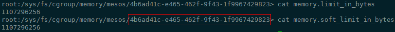
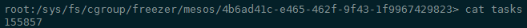
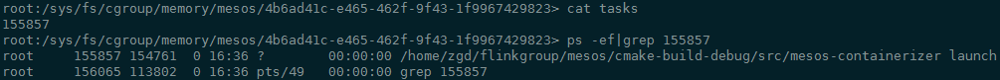

## Mesos Containerizer 

Mesos Containerizer是mesos agent的关键部件，提供容器化所需的服务。

* 位于agent和容器之间
* 启动、更新和销毁容器
* 提供容器间的隔离
* 上报容器状态

> 当前mesos支持以多种方式提供容器服务：Docker Containerizer、Mesos Containerizer以及两者混合。Mesos Containerizer更加稳定。

Mesos Containerizer主要包括以下三个组件：

* Launcher，负责启动和销毁容器进程
* Isolator，最主要的功能组件，通过cgroup、namespace实现容器间资源隔离
* Provisioner，提供容器镜像支持

容器启动的主要步骤如下：

1. Isolator准备

   包含创建cgroup目录和初始化cgroup subsystem相关参数等操作。举一个cgroup subsystem为memory的例子，经过`CgroupsIsolatorProcess::prepare`的调用过程后，新生成了如下cgroup目录，并设置相关初始化参数

   

2. 通过Launcher启动容器进程

   Launcher的具体实现`LinuxLauncher`通过libprocess的actor模型调用`LinuxLauncherProcess::fork`创建容器子进程。主要包括创建subsystem为freezer的cgroup，并将子进程pid放入其中，如下图所示：

   

   放入freezer cgroup的进程会暂停，直到隔离和fetch完成后，在exec时通过信号将子进程唤醒。

3. 隔离容器进程

   Isolator的具体实现有很多，主要包括cgroup、network cni等资源隔离接口，其中cgroup的隔离的过程就是将进程pid放入对应的cgroup中。具体实现在`CgroupsIsolatorProcess::isolate`

   

4. fetch容器资源

   fetch是一种在容器任务准备时将容器资源下载到沙箱目录的机制，为后续的exec过程做准备。

5. 执行容器进程

   之前fork出来的容器子进程被唤醒。

   ​