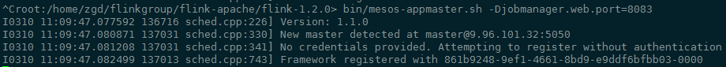

## Mesos安装部署与Sandbox简述

[TOC]

#### 1.下载安装

从官网下载Mesos的rpm安装包（[下载链接](http://repos.mesosphere.com/el/7/x86_64/RPMS/mesos-1.1.0-2.0.107.centos701406.x86_64.rpm)）并在所有集群节点中安装mesos

```shell
rpm -ivh mesos-1.1.0*.rpm
```

> 可能会报libevent-devel依赖未安装，使用命令``yum install libevent libevent-devel -y``安装

#### 2.集群部署

* 在``/usr/etc/mesos``目录下增加名为masters和slaves的文件，分别配上master节点和agent(worker)节点的ip列表，以换行分隔，以1个master节点2个agent节点为例：

  

* 在master节点所在机器的``/usr/etc/mesos``目录下，增加mesos-master-env.sh脚本（在相同目录下已存在模板），配置mesos工作目录环境变量``export MESOS_work_dir=/xxx/xxx``

  

* 在agent节点所在机器（在本例中，包括9.96.101.32和9.96.101.251两个节点）的``/usr/etc/mesos``目录下，增加mesos-agent-env.sh脚本（在相同目录下已存在模板），配置mesos master地址``export MESOS_master=xx.xx.xx.xx:5050``，和mesos工作目录环境变量``export MESOS_work_dir=/xxx/xxx``

  

* 运行``/usr/sbin/mesos-start-cluster.sh``启动集群

  

* 访问mesos web页面``http://masterIP:5050``可以查看mesos集群状态和agent列表等信息

  


  

#### 3.部署Flink到Mesos

* 修改``FLINK_HOME/conf/flink-conf.yaml``，增加三个配置项：``mesos.resourcemanager.tasks.container.type``、``mesos.master``、``mesos.initial-tasks``，如下图所示，其中mesos.initial-tasks配置项表示taskmanager个数。

  

* 运行``FLINK_HOME/bin/mesos-appmaster.sh``向mesos注册schduler并启动jobmanager

  

* 查看mesos web页面，可以看到刚才启动的Flink集群在mesos中体现为1个Framework和2个Task（executor），每个java进程（mesos中的executor，flink中的taskmanager）对应一个sandbox

  

#### 4.查看沙箱目录

沙箱是每个mesos executor工作时的临时目录。存在于agent节点的工作目录下，工作目录的配置见上文。沙箱的目录结构在官方文档中描述如下：

```
root ('--work_dir')
|-- slaves
|   |-- latest (symlink)
|   |-- <agent ID>
|       |-- frameworks
|           |-- <framework ID>
|               |-- executors
|                   |-- <executor ID>
|                       |-- runs
|                           |-- latest (symlink)
|                           |-- <container ID> (Sandbox!)
```

登陆到本例中task所在节点9.96.101.251查看两个task各自的sandbox目录，包含了进程的标准输出、错误、日志，以及flink上传的jar包、配置文件和shell脚本等，与yarn的container目录很类似。


沙箱中的文件包含如下三部分：

* mesos在启动executor的task前获取的文件（flink文件夹）
* executor的输出（stderr，stdout）
* executor创建的文件（flink-taskmanager.log等）