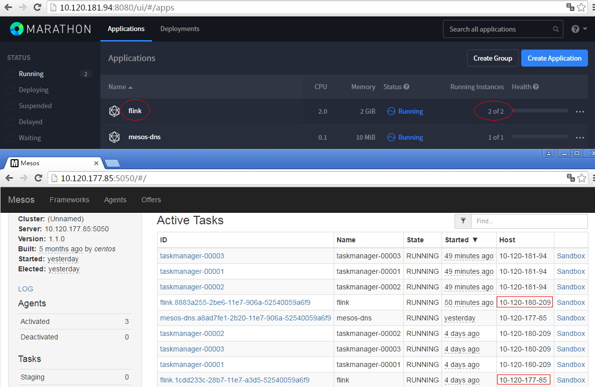
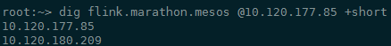

## Service Discovery with Mesos-DNS

[TOC]

#### 1.下载

[Github release](https://github.com/mesosphere/mesos-dns/releases)下载linux版本的二进制可执行文件。

#### 2.配置

Mesos-DNS启动需要指定一个json格式的配置文件，默认为当前目录下名为`config.json`的文件，以下给出一个示例：

```json
{
    "zk": "zk://10.120.177.85:2181,10.120.181.94:2181,10.120.180.209:2181/mesos",
    "refreshSeconds": 60,
    "ttl": 60,
    "domain": "mesos",
    "port": 53,
    "resolvers": ["10.72.255.100","10.72.55.82","10.98.48.39"],
    "timeout": 5
}
```

具体参数说明参见[官网链接](http://mesosphere.github.io/mesos-dns/docs/configuration-parameters.html)

Mesos-DNS使用53端口监听DNS服务请求，启动前需要确保53端口未被占用：

```shell
netstat -lnpt | grep 53
```

查看系统监听的端口，在CentOS 7中可能存在`dnsmasq`服务占用53端口，使用`systemctl stop dnsmasq`停止dnsmasq服务。

#### 3.启动

修改步骤1下载获取的二进制文件可执行权限：

```shell
chmod +x mesos_dns
```

可以在命令行直接启动Mesos-DNS并后台运行：

```shell
/usr/local/mesos-dns/mesos-dns -config /usr/local/mesos-dns/config.json &
```

推荐的做法是在Marathon中启动Mesos-DNS，编写Marathon应用描述文件并提交，样例如下：

```json
{
    "id": "mesos-dns", 
    "cmd": "/usr/local/mesos-dns/mesos-dns -config /usr/local/mesos-dns/config.json",
    "cpus": 0.1,
    "mem": 10.0,
    "instances": 1,
    "constraints": [["hostname","CLUSTER","10-120-177-85"]]
}
```

#### 4.测试

在步骤3的样例中，我们在`10.120.177.85`上启动了Mesos-DNS服务，使用dig命令便可找到在Marathon中发布的服务（本例中服务名为flink，即Marathon中的应用名）所在的节点IP，当服务存在多个instance时，会列出所有instance所在节点的IP列表：

```shell
dig flink.marathon.mesos @10.120.177.85 +short
```

说明：dig命令用于DNS查找，@后跟着Mesos-DNS服务所在节点，可以在/etc/resolv.conf中增加一行`nameserver 10.120.177.85`便可省略@10.120.177.85，+short表示只显示IP，不显示详细信息。

在本例中启动的flink服务有两个实例：



dig命令运行结果如下：



