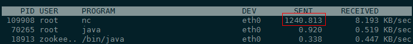
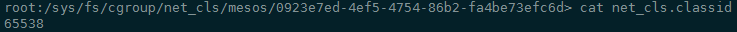
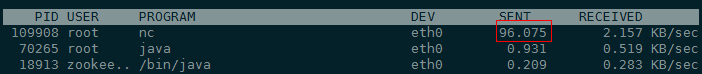

## mesos net_cls test

#### 1.mesos启动参数配置

slave启动参数配置，增加net_cls

```shell
echo cgroups/cpu,cgroups/mem,cgroups/net_cls > /etc/mesos-slave/isolation
```

增加mesos-slave启动参数`--cgroups_net_cls_primary_handle=0x0001`，可以通过修改`/usr/bin/mesos-init-wrapper`脚本实现，最终mesos-slave启动参数如下：

```shell
/usr/sbin/mesos-slave --master=zk://10.120.177.85:2181,10.120.181.94:2181,10.120.180.209:2181/mesos --log_dir=/var/log/mesos --cgroups_net_cls_primary_handle=0x0001 --containerizers=mesos --isolation=cgroups/cpu,cgroups/mem,cgroups/net_cls --work_dir=/var/lib/meso
```

此时mesos会为每个容器分配一个16位的cgroups_net_cls_secondary_handle，和cgroups_net_cls_primary_handle(0x0001)一起组成一个classid。

#### 2. 启动应用

使用marathon提交nc命令行应用，向对端发数据：

```json
{
  "id": "/basic-023",
  "cmd": "yes ssssssssssssssssssssss|nc 10.162.174.188 5567",
  "cpus": 1,
  "mem": 10,
  "disk": 0,
  "instances": 1
}
```

使用`nethogs`工具查看进程流量：



#### 3. 启用流控规则

查看容器进程的classid：



65538 = 0x00010002

使用tc工具配置规则：

```shell
tc qdisc del dev eth0 root
tc qdisc add dev eth0 root handle 1: htb
tc class add dev eth0 parent 1: classid 1: htb rate 1000mbit ceil 1000mbit
tc class add dev eth0 parent 1: classid 1:2 htb rate 1mbit
tc filter add dev eth0 protocol ip parent 1:0 prio 1 handle 1:2 cgroup
```

查看进行流控后的容器进程流量：

